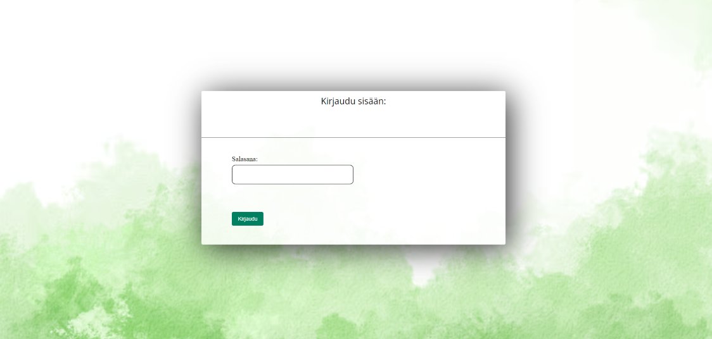
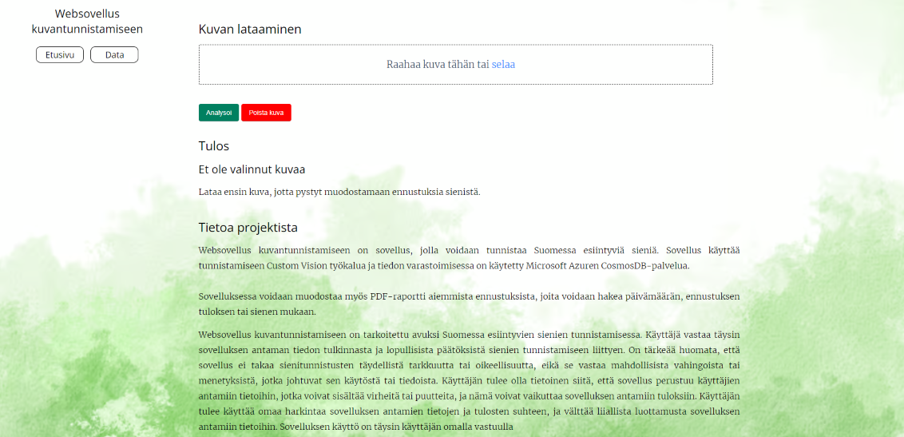
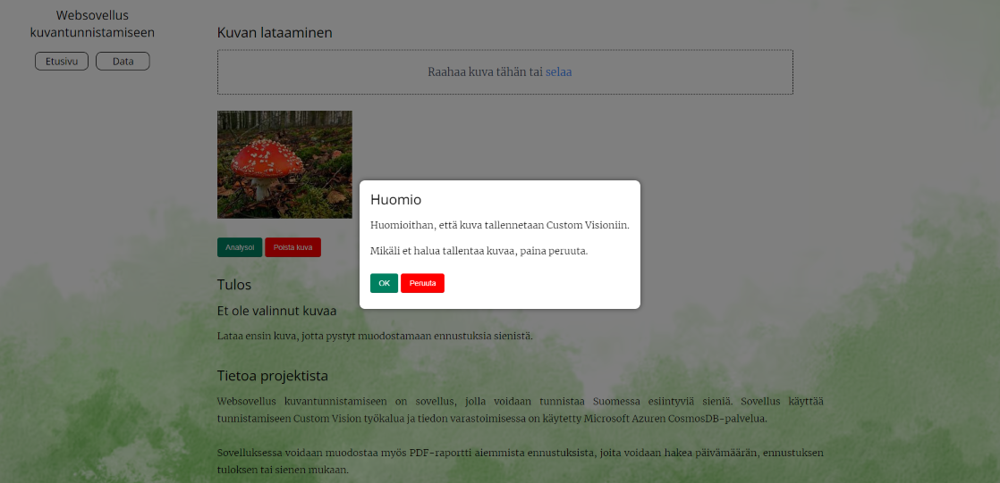
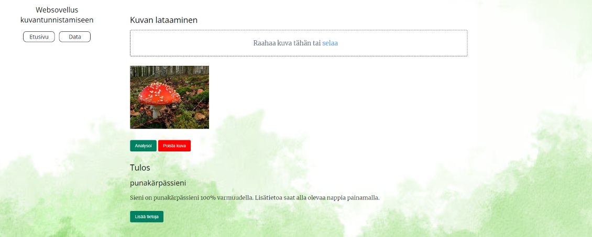
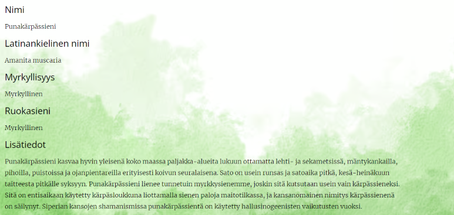
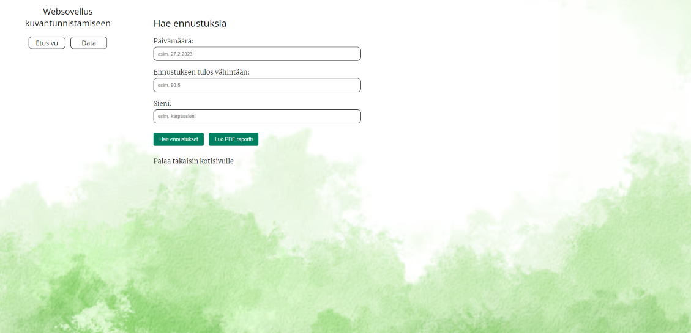

# Projektin esittely

Websovellus kuvantunnistamiseen on sovellus, jolla voidaan tunnistaa Suomessa esiintyviä sieniä.
Sovellus käyttää tunnistamiseen Custom Vision työkalua ja tiedon varastoimisessa (NoSQL tietokanta) Microsoft Azuren CosmosDB-palvelua.

Sovelluksessa voidaan muodostaa myös PDF-raportti aiemmista ennustuksista, joita voidaan hakea päivämäärän, ennustuksen tuloksen tai sienen mukaan.

Sovellus on tehty 'mobile-first' ajatuksella.

# Teknologiat ja vaatimukset

Sovellus on kehitetty JavaScriptillä, Node.js:llä, HTML:llä sekä CSS:llä. Kehittämiseen on käytetty Azuren versionhallintaa. Sovelluksen käyttämiseen ja devaamiseen käyttäjän tulee tehdä oma tietokanta Azuren CosmosDB:llä sekä AI kirjasto Custom Visionilla. Tarkemmat asennusohjeet löytyvät alempaa. 

Azuren resurssit ovat tiettyyn pisteen asti ilmaiset, jonka vuoksi sovelluksesta on tarjolla ainoastaan lähdekoodi. 
[Käyttöliittymä](#käyttöliittymä) osiossa esitellään tarkemmin ulkoasu ja tärkeimmät toiminnot.

Devausympäristössä Node.Js käyttö on myös välttämätöntä. Tarkemmat asennusohjeet löytyvät [NodeJS asennus](#nodejs) kohdasta.

# Käyttöliittymä

Käyttöliittymään on toteuttu kirjaudu sisään ikkuna. Tällä pyritään suojaamaan väärinkäyttöä, koska Azuren resurssit ovat tiettyyn pisteen ilmaiset.

Etusivulla on mahdollisuus hakea sieni kansiosta selaamalla tai raahaamalla kuva. Sienen tunnistaminen tapahtuu 'Analysoi'-painikkeesta. 

Etusivulta pystyy myös suunnistamaan data-sivustolle, jossa käyttäjä pystyy hakemaan aiempia ennustuksia sienen nimen, päivämäärän tai ennustuksen tuloksen mukaan.

Käyttäjän laatamat kuvat tallennetaan Custom Vision työkaluun, joten siitä ilmoitetaan käyttäjälle. Käyttäjä voi tässä vaiheessa peruttaa toiminnon, jolloin tunnistaminen keskeytetään eikä kuvaa tallenneta Custom Vision työkaluun. 

Käyttäjälle ilmoitetaan tunnistuksen tulos. Mikäli tunnistus on alle 95 prosenttia - ilmoitetaan, ettei kuvaa pystytty tunnistamaan. Käyttäjä voi halutessaan hakea lisätietoja sienestä 'Lisää tietoja'-painikkeesta. 

NoSQL tietokantaan on syötetty seuraavat tiedot, jotka näytetään käyttäjälle. Tietokanta on helposti muokattavissa, jolloin tarvittavia tietoa voidaan asettaa myöhemmässä vaiheessa.  

Etusivulta pääsee suunnistamaan data-sivustolla, jossa käyttäjä pystyy hakemaan aiempia ennustuksia sienen nimen, päivämäärän tai ennustuksen tuloksen mukaan. Tulos esitetään taulukossa, josta on mahdollista tehdä PDF-raportti. 

# Node.Js

- #### Node.js asentaminen windows käyttöjärjestelmään:

  - [Node.js viralliset kotisivut](https://nodejs.org/), lataa 18.14.0 LTS versio.
  - Ylimääräisiä 'työkaluja' ei tarvitse asentaa tähän projektiin.
  

  

# Azure CosmosDB käyttöönotto

- #### Luo CosmosDB tunnus (Azure Cosmos DB account)
- #### Luo tunnuksen alle NoSQL tietokanta
- #### Luo tietokantaan kaksi containeria (taulua) nimeltään "sienitiedot" ja "tunnistukset"
- #### Lisää sienten lisätiedot halutuista sienistä JSON muodossa seuraavalla tavalla:
    {
    "sieniID": "1",
    "nimi": "Kantarelli",
    "latnimi": "Cantharellus cibarius",
    "myrkyllisyys": "Ei myrkyllinen",
    "ruokasieni": "Kolmen tähden ruokasieni",
    "tiedot": "Keltavahvero eli kantarelli kuuluu suosituimpiin metsäsieniimme."
    }
- #### Lisää env muuttujaan APPSETTING_COSMOS_ENDPOINT tiedokannan osoite
- #### Anna App Service- resurssille oikeus käyttää tietokantaa (RBAC)
- #### Jos haluat käyttää tietokantaa lokaalisti, pitää oikeus antaa yksittäiselle käyttäjälle tai ryhmälle esimerkiksi Azure CLI avulla (RBAC)

# Custom Vision käyttöönotto

- #### Luo Custom Visioniin training- resurssi
- #### Syötä resurssille kuvia sienistä (esimerkiksi 20 kuvaa / sieni) ja aseta niille tagit sienen nimen mukaan
- #### Kouluta resurssia (Training)
- #### Julkaise training- resurssista Custom Vision predict resurssi (jokaisesta koulutuskierroksesta muodostuu uusi iteraatio)
- #### Kopioi muuttujat env muuttujiksi seuraavalla tavalla:
- #### APPSETTING_PREDICTION_KEY = Custom Vision predict- resurssin avain
- #### APPSETTING_PREDICTION_ENDPOINT = Custom Vision predict- resurssin osoite
- #### APPSETTING_PUBLISH_ITERATION_NAME = Custom Visionissa julkaistun iteraation nimi
- #### APPSETTING_CUSTOM_VISION_PROJECT_ID = Custom Visionin projektin ID

# Storagen käyttöönotto

- ### Luo Storage- tunnus (Storage account)
- ### Luo Container(blob) nimeltään "images", johon tunnistetut kuvat ladataan
- ### Luo Storage accountille SAS (Single Access Signature)- token, jonka avulla ohjelma saa oikeuden Containerin käyttöön
- ### Kopioi env muuttujat seuraavalla tavalla:
- ### APPSETTING_BLOB_SAS_TOKEN = Storage accountille luotu SAS token
- ### APPSETTING_IMAGE_BLOB_URL = Storage accountin osoite

# App services

- ### Luo Node.js sovellus
- ### Luo uusi Web App Azureen
- ### Deployaa sovellus Web Appiin

# Sovelluksen ajaminen kehitysympäristössä

- ### Edelliset ympäristömuuttuja arvot on asetettava config.env tiedostoon.

- ### Asenna riippuvuudet komennolla ``npm install``
- ### Kehitysympäristössä sovellus voidaan käynnistää ``npm start server.js``

# Tekijänoikeus ja lisenssi

Copyright 2023 Joonas Kortelainen, Peetu Hurskainen, Joose Kokkonen & Lauri Komulainen